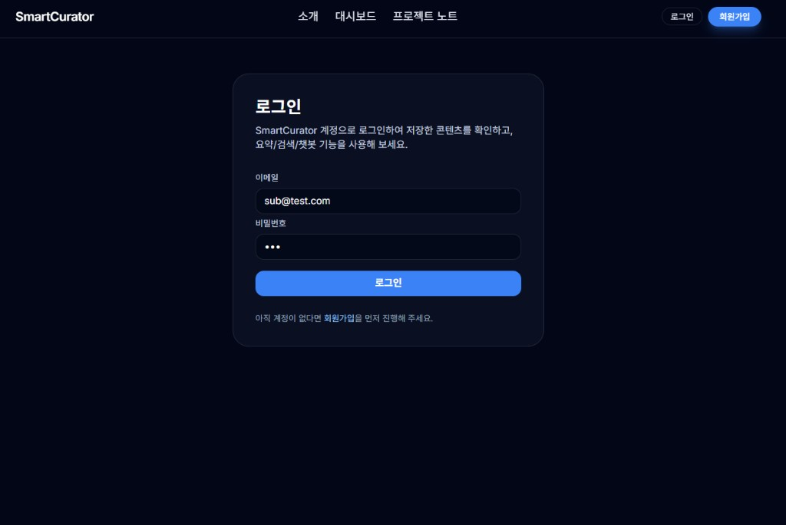
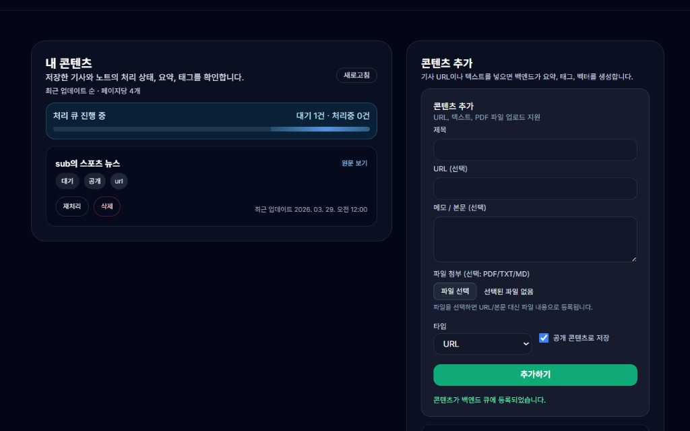
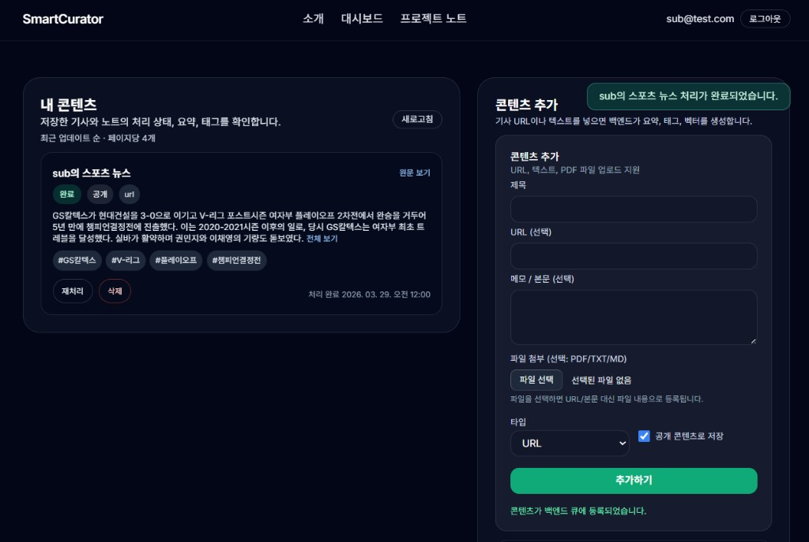
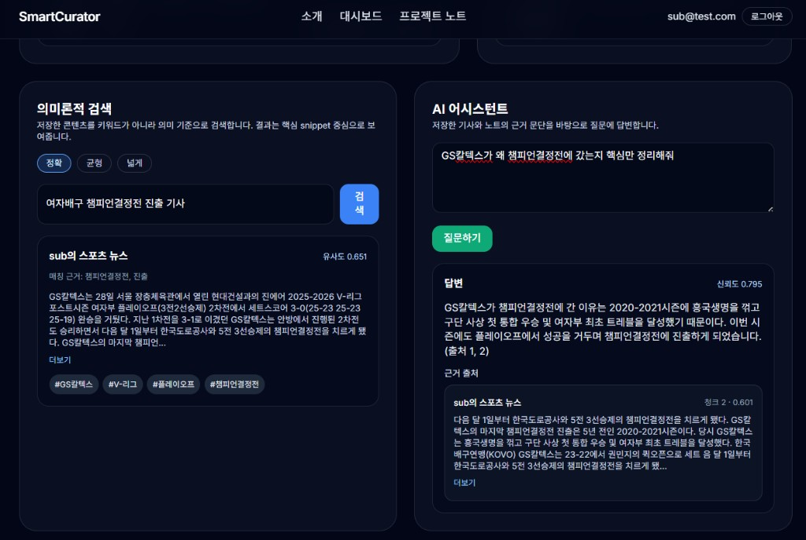

# SmartCurator

기사 링크·메모·PDF를 저장하면 **자동으로 요약·태그·벡터 인덱싱**이 돌고,
나중에 **비슷한 뜻으로 검색**하거나 **내 자료만 근거로 AI에게 질문**할 수 있는 개인용 서비스입니다.

## 데모

| 항목 | 내용 |
|------|------|
| **주소** | <https://www.smartcurator.site/> |
| **구조** | 화면(Next.js)은 **Vercel**, API·Celery·DB·검색은 **로컬**, 외부 연결은 **Cloudflare Tunnel** |
| **트레이드오프** | 클라우드 비용 0에 가깝게 유지. PC·네트워크 상태에 따라 API가 잠시 끊길 수 있음 |

배포 판단 근거는 [docs/DEPLOYMENT_DECISION.md](docs/DEPLOYMENT_DECISION.md)에 정리돼 있습니다.

## 핵심 기능

- URL / 텍스트 / PDF 콘텐츠 저장
- Celery 비동기 처리 (pending → processing → completed / failed)
- 본문 요약 + 태그 자동 생성 (OpenAI)
- Qdrant chunk 단위 벡터 인덱싱 (ko-sRoBERTa)
- 의미 검색 + 하이브리드 재정렬 (유사도 + 토큰 오버랩)
- RAG 답변 + 근거 출처(snippet) 제공
- 랜딩 페이지에서 바로 프리뷰 + AI 채팅 (비로그인은 모달 안내)
- 대시보드 **「내 자료 / 검색·AI」** 탭 분리, URL 딥링크 (`?view=explore`)
- 내 콘텐츠 최근순 페이지네이션 (페이지당 3개)
- 카드 안 태그 클릭 → 즉시 필터
- 라이트/다크 테마 + 상태 배지·칩 대비 보장
- Access/Refresh 토큰 기반 자동 세션 갱신
- 처리 완료/실패 토스트 알림

## 스크린샷

| 로그인 | 대시보드 — 처리 큐 |
|:--:|:--:|
|  |  |

| 대시보드 — 요약·태그·토스트 | 의미 검색 + RAG 어시스턴트 |
|:--:|:--:|
|  |  |

## 최근 변경 (2026-04)

- **대시보드 탭 구조**: 「내 자료」와 「검색·AI」를 탭으로 나눠 스크롤 부담을 줄임
- **페이지당 3개**: 카드 밀도를 낮춤
- **랜딩 AI 채팅**: 프리뷰 카드 안에서 요약 확인 + RAG 질문, 새 자료 가져오면 대화 초기화
- **비로그인 모달**: 가져오기 시도 시 화면 중앙에 회원가입/로그인 모달
- **라이트 모드 대비 수정**: CTA·탭·배지·칩에 테마별 CSS 변수 적용
- **검색 스니펫 정리**: 뉴스 잡문구·깨진 URL 자동 제거, 잡음이 심하면 요약으로 대체
- **제목 줄바꿈**: `break-keep` + `whitespace-nowrap`으로 한글 어미 단위 깨짐 방지

## 기술 스택

| 영역 | 사용 기술 |
|------|-----------|
| 백엔드 | FastAPI, SQLAlchemy, PostgreSQL, Alembic |
| 워커 | Celery, Redis |
| 검색 | Sentence Transformers (`jhgan/ko-sroberta-multitask`), Qdrant |
| LLM | OpenAI GPT |
| 프론트 | Next.js 14 (App Router), React 18, Tailwind CSS |

## 인증 구조

- Access Token: 30분 / Refresh Token: 14일
- 프론트 저장 키: `smartcurator_token`, `smartcurator_refresh_token`, `smartcurator_email`
- 만료 2분 전 자동 `/auth/refresh` → 실패 시 로그아웃

## 주요 API

```text
POST   /auth/register
POST   /auth/login
POST   /auth/refresh
GET    /auth/me
PUT    /auth/profile
POST   /auth/logout

GET    /health
POST   /contents/
POST   /contents/upload
GET    /contents/my
GET    /contents/{id}
PUT    /contents/{id}
DELETE /contents/{id}
POST   /contents/{id}/reprocess

GET    /search/semantic
GET    /search/public
GET    /search/health

POST   /chat/ask
GET    /chat/health
```

## 로컬 실행

### 1) 의존 서비스

```bash
docker run -d -p 6379:6379 redis:latest
docker run -d -p 6333:6333 qdrant/qdrant:latest
docker run -d -p 5432:5432 -e POSTGRES_PASSWORD=password postgres:15
```

PostgreSQL DB 생성:

```bash
docker exec -it <postgres-container-id> psql -U postgres -c "CREATE DATABASE smartcurator;"
```

### 2) 백엔드

`.env.example`을 복사해서 `.env`를 만들고, 키를 채워 넣으세요.

```bash
pip install -r requirements.txt
alembic upgrade head
python init_vector_db.py
uvicorn app.main:app --reload
```

### 3) Celery

```bash
celery -A app.core.celery_app worker --loglevel=info
```

Windows라면:

```bash
celery -A app.core.celery_app worker --loglevel=info --pool=solo --concurrency=1
```

### 4) 프론트

```bash
cd frontend
npm install
npm run dev
```

`frontend/.env.local`:

```env
NEXT_PUBLIC_API_BASE_URL=http://localhost:8000
```

## 돌려 본 뒤 체크

1. 회원가입 → 로그인
2. 콘텐츠 몇 개 넣기 (URL, 메모, PDF)
3. pending → processing → completed (또는 failed) 흐름이 보이는지
4. 완료/실패 토스트가 뜨는지
5. 「검색·AI」 탭에서 의미 검색 — 정확 / 균형 / 넓게 모드 전환
6. AI 질문 후 답변 + 근거 스니펫
7. 랜딩 페이지에서 프리뷰 + AI 채팅 동작
8. 라이트 모드 전환 후 배지·버튼 가시성
9. 오래 켜 두고 토큰 자동 갱신 확인
