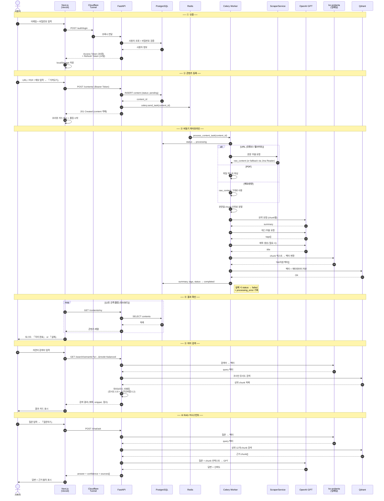
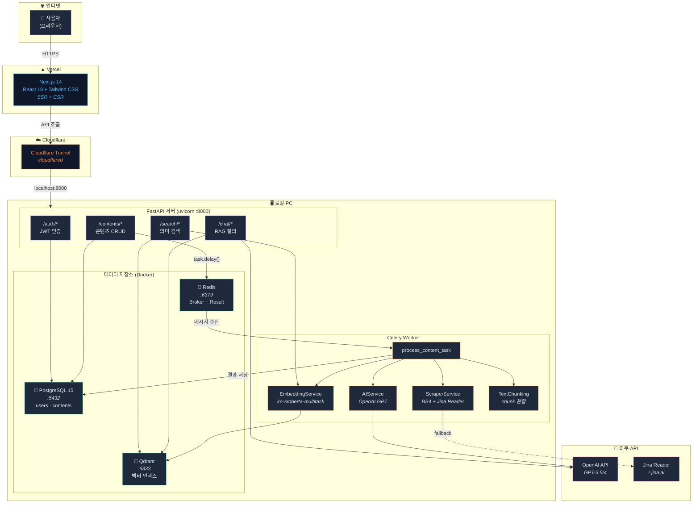
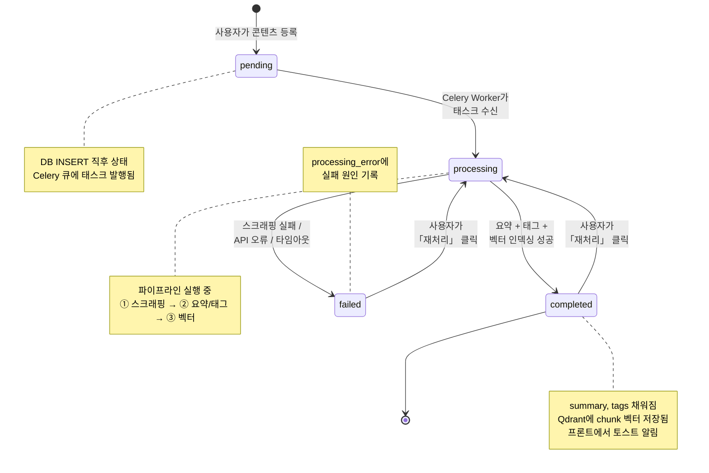
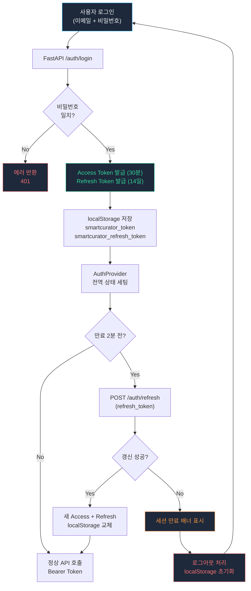

# SmartCurator 다이어그램

## 1. 순차 흐름 (Sequence Diagram)

콘텐츠를 등록하고 요약·검색·AI 질문까지의 전체 흐름입니다.

## 2. 시스템 아키텍처 (Architecture Diagram)

배포 구조와 컴포넌트 간 관계를 보여줍니다.

## 3. 콘텐츠 상태 흐름 (State Diagram)

하나의 콘텐츠가 거치는 상태 전이입니다.

## 4. 인증 흐름 (Auth Flow)

토큰 발급부터 자동 갱신까지의 흐름입니다.

